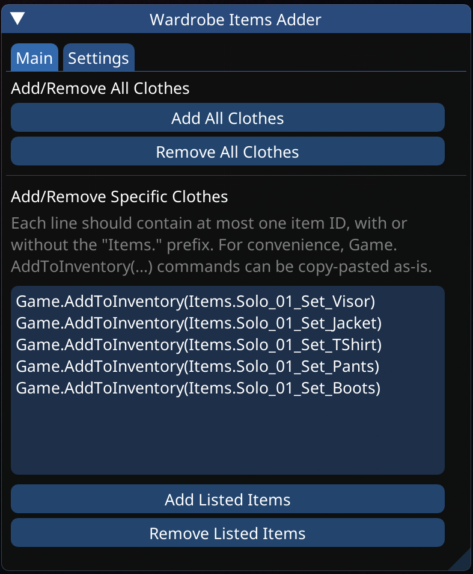

# Wardrobe Items Adder

Small utility mod for Cyberpunk 2077. Published also on [NexusMods](https://www.nexusmods.com/cyberpunk2077/mods/5742).

Add/remove all or only specific clothes to/from the wardrobe without cluttering the inventory.

## Features

* Ability to add all available clothes in the game directly to the wardrobe, bypassing the inventory
  * The list of clothes is read from the internal game database, which means the mod should work automatically with future patches, DLCs, and other mods
  * This approach has a risk of adding broken clothes, but the mod attempts to filter them out
  * In case you want to turn the filters off, there is an option for that too, although not recommended
* Ability to add only specific clothes to the wardrobe by providing a list of item IDs or `Game.AddToInventory(...)` commands
* Ability to remove all/specific clothes from the wardrobe (thanks to @[SweetHansel](https://github.com/SweetHansel))
* Simple UI in the [Cyber Engine Tweaks](https://www.nexusmods.com/cyberpunk2077/mods/107) overlay
* Install-and-forget option to automatically add all clothes when the player spawns

**Note.** The mod only supports the base game's wardrobe system. It is not guaranteed to work with mods using their own transmog system.

## Requirements

* [Cyber Engine Tweaks](https://www.nexusmods.com/cyberpunk2077/mods/107) - make sure it's up-to-date after every game's patch
* (Optional) [Codeware](https://www.nexusmods.com/cyberpunk2077/mods/7780)  - needed for item removal feature to work

## Installation

1. Install the requirements listed above.
2. Download the archive with the mod.
3. Extract it to the Cyberpunk 2077 installation folder.

The final directory structure should be `{Cyberpunk 2077 installation folder}/bin/x64/plugins/cyber_engine_tweaks/mods/wardrobe_items_adder`, and this folder should contain `.lua` files.

## Basic Usage

1. Load a save.
2. Open the Cyber Engine Tweaks overlay/console.
3. The *"Wardrobe Items Adder"* window should appear.



Adding/removing all clothes is as simple as clicking the button.

To add/remove only specific clothes, their IDs have to be provided, with or without the `Item.` prefix, one per line. There are several sources where one can find the IDs, for example the [wiki](https://cyberpunk.fandom.com/wiki/Cyberpunk_2077_Clothing) or the [spreadsheet](https://docs.google.com/spreadsheets/d/1iuq4Srh_661PdY_17bnrU15UbtCLieO_0ZhQ0uqQ0_Y/edit#gid=0), or a clothing mod description page. Specific commands like `Game.AddToInventory("Items.item_id", 1)` are often provided, so for convenience such commands can be copy-pasted directly into the text area and the script should be able to extract the item IDs by itself.

In the settings tab you can find an option to automatically add all clothes on player spawn. With this option you won't have to click the button manually after starting a new save or installing a new clothing mod.

**In case of issues, please check the logs in the console window before reporting a bug.**

## Uninstallation

Delete the `{Cyberpunk 2077 installation folder}/bin/x64/plugins/cyber_engine_tweaks/mods/wardrobe_items_adder` directory.

## Alternative

In case you don't want to install this mod, here's a command to add an item to the wardrobe.

```plain
Game.GetWardrobeSystem():StoreUniqueItemIDAndMarkNew(ItemID.FromTDBID("ITEM_ID_HERE"))
```

The base game doesn't allow to remove items from the wardrobe, for that you need [Codeware](https://github.com/psiberx/cp2077-codeware/wiki#managing-wardrobe).
